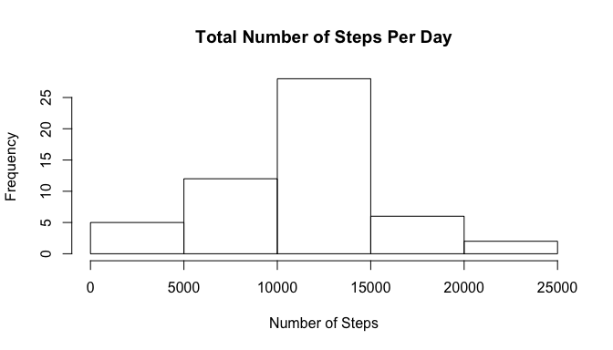
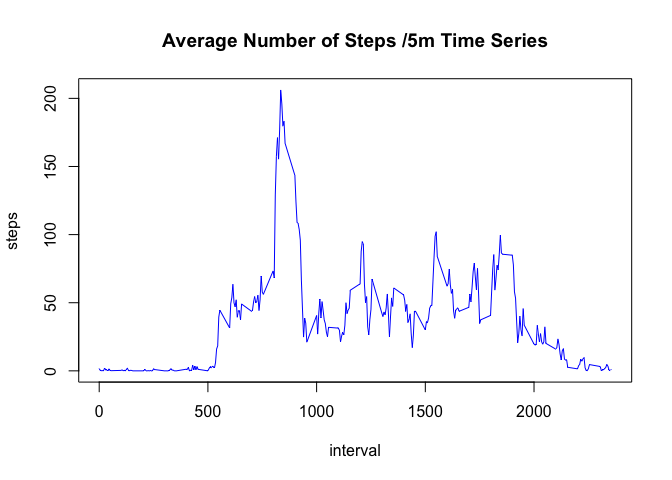
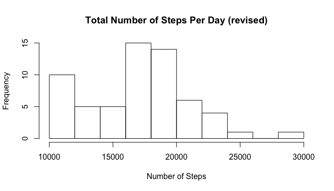
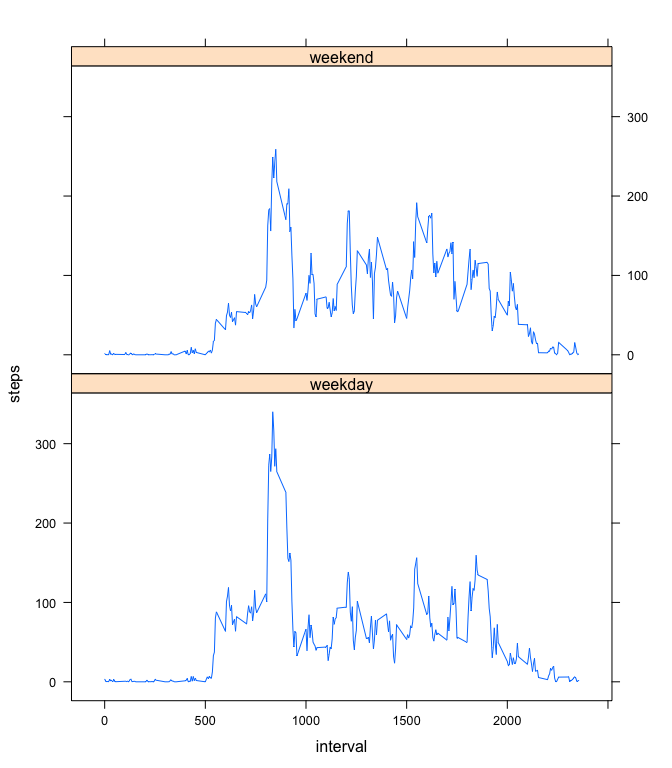

# Reproducible Research: Peer Assessment 1


## Loading and preprocessing the data


```r
d <- read.csv(unz("activity.zip", "activity.csv"),header=TRUE,colClass=c("numeric","Date","numeric"))
head(d)
```

```
##   steps       date interval
## 1    NA 2012-10-01        0
## 2    NA 2012-10-01        5
## 3    NA 2012-10-01       10
## 4    NA 2012-10-01       15
## 5    NA 2012-10-01       20
## 6    NA 2012-10-01       25
```

## What is mean total number of steps taken per day?


```r
d1 <- aggregate(steps ~ date, data=d, FUN=sum)
summary(d1$steps)
```

```
##    Min. 1st Qu.  Median    Mean 3rd Qu.    Max. 
##      41    8841   10760   10770   13290   21190
```

So the mean is **10770** and median is **10760**.

Histogram for the total number of steps taken each day is plotted below:

```r
hist(d1$steps, xlab="Number of Steps", main="Total Number of Steps Per Day")
```

 

## What is the average daily activity pattern?

The time series data of the average number of steps taken for each 5min interval, averaged across all days is generated by:

```r
d2 <- aggregate(steps ~ interval, d, mean)
head(d2)
```

```
##   interval     steps
## 1        0 1.7169811
## 2        5 0.3396226
## 3       10 0.1320755
## 4       15 0.1509434
## 5       20 0.0754717
## 6       25 2.0943396
```

And plotted with interval start time as x-axis, number of steps taken as y-axis:

```r
plot(d2, type="l", main="Average Number of Steps /5m Time Series", col="blue")
```

 

Which 5-minute interval, on average across all the days in the dataset, contains the maximum number of steps?

```r
ix <- sort(d2$steps,index.return=TRUE,decreasing=TRUE)$ix
d2[ix[1],]
```

```
##     interval    steps
## 104      835 206.1698
```

So max number of steps **206.1698113** occurs at time interval starting at **835**.

## Imputing missing values

There are a number of missing values in the original data.  
We can calculate the number of missing values by:

```r
sum(is.na(d$steps))
```

```
## [1] 2304
```

So there are in total **2304** missing step values.

To workaround the missing values we have adopted a strategy by filling in missing values by the 5min interval average across all days. 

```r
t1 <- merge(d,d2, by="interval")
t2 <- transform(t1, steps=pmax(steps.x, steps.y, na.rm=TRUE))[,-c(2,4)]
head(t2)
```

```
##   interval       date    steps
## 1        0 2012-10-01 1.716981
## 2        0 2012-11-23 1.716981
## 3        0 2012-10-28 1.716981
## 4        0 2012-11-06 1.716981
## 5        0 2012-11-24 1.716981
## 6        0 2012-11-15 1.716981
```

With the revised new dataset t3 we can redraw the histogram as well as summarize the data to find mean and median:

```r
t3 <- aggregate(steps ~ date, data=t2, FUN=sum)
summary(t3$steps)
```

```
##    Min. 1st Qu.  Median    Mean 3rd Qu.    Max. 
##   10770   14300   17360   17050   19200   28460
```

So the new mean is **17050** and new median is **17360**.

And the new histgram looks like:

```r
hist(t3$steps, xlab="Number of Steps", main="Total Number of Steps Per Day (revised)")
```

 

And can be seen compared with directly using raw data, the mean and median does get impacted and tends to be bigger.

## Are there differences in activity patterns between weekdays and weekends?

We start by classifying revised data's day type to be either weekday or weekends.

```r
t2$dayType <- as.factor(ifelse(weekdays(t2$date) %in% c("Saturday", "Sunday"), "weekend", "weekday"))
```

Then we aggregate by weekday and weekend separately:

```r
t4 <- aggregate(steps ~ interval + dayType, t2, mean)
head(t4)
```

```
##   interval dayType     steps
## 1        0 weekday 3.6247379
## 2        5 weekday 0.7320755
## 3       10 weekday 0.2846960
## 4       15 weekday 0.3253669
## 5       20 weekday 0.1626834
## 6       25 weekday 3.2658281
```

And we can plot them in parallel to show the difference between weedays and weekends:

```r
library(lattice)
xyplot(steps ~ interval|dayType, data=t4, type="l", layout=c(1,2))
```

 
